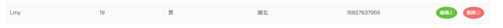

##Springboot+vue 增删改查的小项目

###1.介绍
Springboot+vue 前后端分离的增删改查小项目

###2.核心功能
实现前后端交互 连接数据库实现增删改查

###3.软件架构
前端:Vue 2.0+ElementUI+JS(JQuery)
后端:SpringBoot+SpringBoot JPA
数据库: MySql(8.0.26) 
JDK:1.8

###3.1 目录结构

###4.项目流程

###4.1 导入工具类

Result工具类(后端响应结果给前端的工具类)

WebMvcConfig工具类(解决前后端跨域工具类)

###4.2 配置文件

连接数据库的配置文件

###4.3 创建数据库

####表结构

####表数据

###4.4功能实现

####4.4.1 定义一个实体类User(和数据库相对应)

####4.4.2 定义Dao(Mapper层)

####4.4.3 定义增删改查的方法(Service层)

####4.4.4 定义接口(Controller层)

###4.5 前端页面

####4.5.1 导入Jquery,Vue,ElementUI
注意:css样式引入一般都在开头
    js样式引入一般都在结尾

####4.5.2 前端UI 绑定点击事件
ElementUI官网: 
https://element.eleme.cn/#/zh-CN/component/table

代码实现:

###5.运行结果
####界面

####新增功能

####修改功能

####删除功能

####分页

项目总结:
第一次自己实现CRUD 加上页面 对基础的CRUD小项目有了一定的认知还会继续努力的
创作者:Lmy

